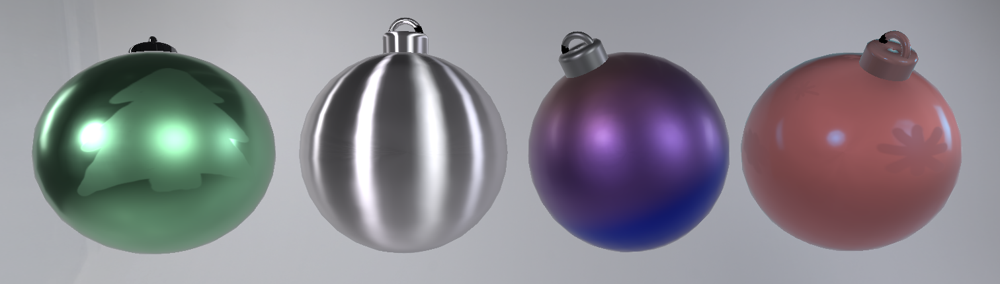
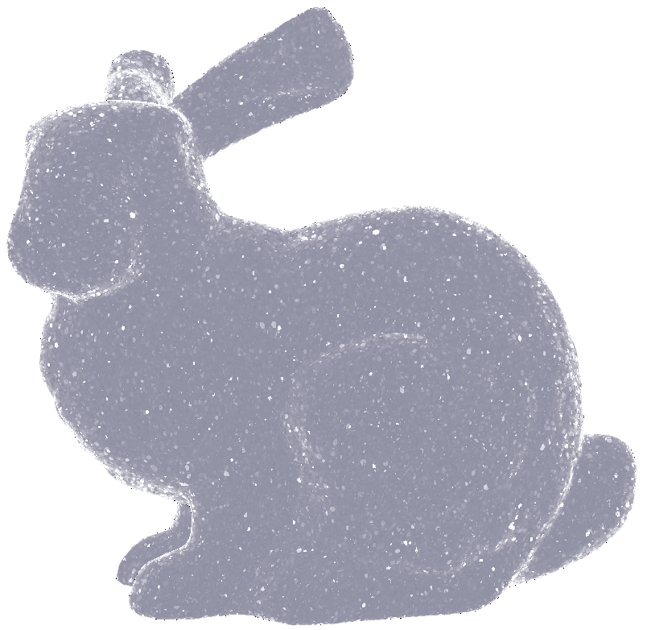

# Lab-ComputerGraphics-WS2023

A real-time implementation of layered materials[^1][^2][^3] and glinty materials[^4] in OpenGL.

## Layered Materials[^1][^2][^3] (implementation by Robin Landsgesell)

## Glints[^4] (implementation by Julian Stamm)

[^1]: Belcour, Laurent. "Efficient rendering of layered materials using an atomic decomposition with statistical operators." ACM Transactions on Graphics 37.4 (2018): 1.
[^2]: Weier, Philippe, and Laurent Belcour. "Rendering layered materials with anisotropic interfaces." Journal of Computer Graphics Techniques (JCGT) 9.2 (2020): 20.
[^3]: Yamaguchi, Tomoya, et al. "Real-time rendering of layered materials with anisotropic normal distributions." SIGGRAPH Asia 2019 Technical Briefs. 2019. 87-90.
[^4]: Deliot, T., and L. Belcour. "Real-Time Rendering of Glinty Appearances using Distributed Binomial Laws on Anisotropic Grids." (2023).
